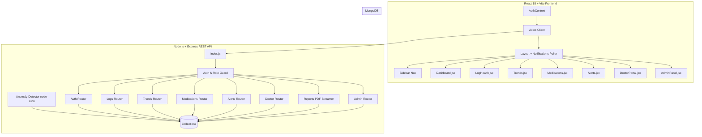

# Walkthrough — VitalTrack Implementation

We have successfully built and verified the **VitalTrack** Community Health Tracker web application. This document details the features implemented, the system architecture, and how to verify the flows.

---

## 🏗️ Implemented Architecture & System Flow



---

## 🔒 Feature Addon 1 — CRUD Admin Panel

We have implemented a complete admin panel accessible only to users with the `admin` role.

### Backend Endpoints (`/api/admin/*`)
- `GET /stats` — Total counts across all collections.
- **Users:**
  - `GET /users` (paginated, search support).
  - `POST /users` (creates any user role).
  - `PATCH /users/:id` (modifies profile settings).
  - `DELETE /users/:id` (triggers cascade delete on logs, medications, and alerts).
- **Health Logs:**
  - `GET /logs` (paginated, user and date range filters).
  - `POST /logs` (logs vitals for any patient).
  - `PATCH /logs/:id` (edits vitals/symptoms/mood).
  - `DELETE /logs/:id` (removes log entry).
- **Medications:**
  - `GET /medications` (paginated, user filter).
  - `POST /medications` (adds prescription for any patient).
  - `PATCH /medications/:id` (edits prescription details).
  - `DELETE /medications/:id` (removes prescription).
- **Alerts:**
  - `GET /alerts` (paginated, type/resolution filters).
  - `POST /alerts` (manually flags a threshold alert).
  - `PATCH /alerts/:id` (updates severity/resolution).
  - `DELETE /alerts/:id` (removes alert entry).

### Frontend UI Features (`/admin`)
- **Stats Bar:** Displays counts for Users, Logs, Prescriptions, and Active Alerts.
- **Switch Tabs:** Toggles between Users, Logs, Medications, and Alerts views.
- **Data Table:** Supports pagination (Previous/Next), search, and lists properties with corresponding Edit (pencil) and Delete (trash) actions.
- **Slide-in Drawer:** Renders dynamic inputs (like conditions lists, symptoms checkboxes, and mood sliders) and searchable user dropdown lists.

---

## ⚡ Verification Steps

### 1. Database Seeding
Execute the seeder to reset data and add the default administrator:
```bash
npm run seed
```
This adds:
- **Admin account:** `admin@vitaltrack.com` / `Admin@123`
- **Doctor account:** `doctor@vitaltrack.com` / `Doctor@123`
- **Patient accounts:** Rahul Verma and Aisha Patel (`Patient@123`).

### 2. Run the Unified Server
```bash
npm start
```
Open **`http://localhost:5000`** in your browser.

### 3. Admin CRUD Verification Flow
- **Log in** as `admin@vitaltrack.com` / `Admin@123`.
- **Navigation:** You will be automatically redirected to `/admin` and see the stats cards.
- **Search & Filter:** Go to the Users tab, search "Rahul" in the search bar, and verify he appears.
- **Create User:** Click "Add Record" on the Users tab. In the drawer, fill in a name, email, role (`patient`), add conditions (press Enter after typing), configure custom thresholds, and click "Create Entry".
- **Edit User:** Select a user, click the Edit icon, change their role to `doctor`, and click "Save Changes".
- **Logs CRUD:** Go to the Health Logs tab. Click "Add Record". Select a patient in the dropdown, set a date, input vitals, and submit.
- **Verify Alerts:** Go to the Alerts tab. See if alerts generated by the new logs are visible. Select an alert, click the Edit icon, toggle the **Resolved Status** switch, and save.
- **Verify Cascade Deletes:** Go to the Users tab, search for the test patient you created, and click the Delete icon. Accept the browser confirmation. Verify that all of their health logs, medications, and alerts are successfully removed from the database collections.

### 4. AI Advisor Patient Verification Flow
- **Log in** as a patient (e.g., `patient1@vitaltrack.com` / `Patient@123`).
- **Set Preferences:** Go to Settings (user icon) and select dietary preferences (e.g. Vegetarian, Vegan, low sodium). Click "Save Preferences".
- **AI Report Generation:** Click the AI Advisor tab. If you have logged at least 3 logs, click "Generate AI advice". Watch the streaming SSE response complete.
- **Tab Layouts:** Explore the 5 tabs: Physical Health (vitals analysis, risk warning with doctor disclaimer, and 5 action steps), Mental Wellness (lowest mood day correlation, mood activities, counsellor referral if low mood), Nutrition Guide (emerald cards for "Foods to eat", red cards for "Foods to avoid" respecting dietary preferences, meal timing tip), Lifestyle (checklist, focus card), and Medications (active prescriptions list, missed alert flag).
- **Report Sharing:** Click "Share with My Doctor" and select Dr. Priya Sharma from the connections modal.

### 5. Doctor Portal & Annotations Verification Flow
- **Log in** as a doctor (`doctor@vitaltrack.com` / `Doctor@123`).
- **Select Patient:** Select Rahul Verma from the shared patient list. Vitals & Logs tab will render his average indicators and logs list.
- **AI Brief Workspace:** Click the "AI Doctor Brief" tab to view the clinical brief. Verify the color-coded Urgency indicator matches the status (`URGENT` / `SCHEDULED` / `NO IMMEDIATE ACTION`).
- **Interactable Checklist:** Verify the parsed checklist cards with checkbox controls for nutrition/lifestyle items.
- **Physician Annotation:** Scroll down to "Physician Feedback Annotation", write a note (e.g., "Reduce carbohydrate intake before sleep"), and click "Save Note".
- **Dual PDF Triggers:** Test the "Download Patient Report" and "Download Doctor Brief" buttons to ensure the PDFs generate correctly with beautiful formatting, borders, and structure.

### 6. Dashboard Notification Warning Flow
- **Log back in** as the patient.
- **Dashboard Banner:** Verify that an urgent warning banner is displayed at the top of the dashboard.
- **Advisor Note:** Go to the AI Advisor tab. Verify that the doctor's annotation ("Reduce carbohydrate intake before sleep") is highlighted inside a notification card at the top.

### 7. Doctor Trends & Graphs Verification Flow
- **Log in** as a doctor (`doctor@vitaltrack.com` / `Doctor@123`).
- **Select Patient:** Select Rahul Verma from the shared patient list.
- **Open Trends & Graphs Tab:** Click the **Trends & Graphs** tab in the main panel.
- **Verify Charts:** Confirm that interactive line charts (rendered using Recharts) display historical trend lines for:
  - **Glucose** (with threshold warning line matching the patient's custom `glucoseMax` setting)
  - **Blood Pressure** (with dual lines for Systolic and Diastolic pressure, and a threshold line for Systolic max)
  - **Heart Rate** (with threshold warning line matching the patient's custom `heartRateMax` setting)
  - **Weight**
  - **Mood** (from 1 to 10)
- **Select Date Ranges:** Toggle between the "1 Week", "1 Month", and "3 Months" filters to verify that aggregated statistics (Average, Minimum, Maximum) dynamically re-calculate and display correct metrics and units.
- **Cross-Verify Patient View:** Log back in as the patient (e.g. `patient1@vitaltrack.com`) and navigate to the **Trends** page. Verify that the same layout (`PatientTrendsView`) renders the patient's own trends perfectly.


